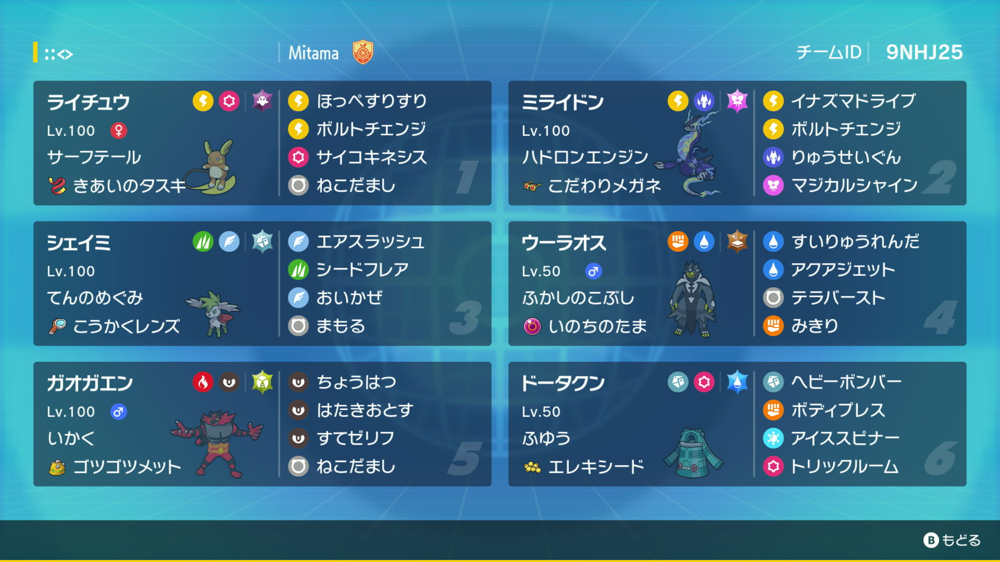
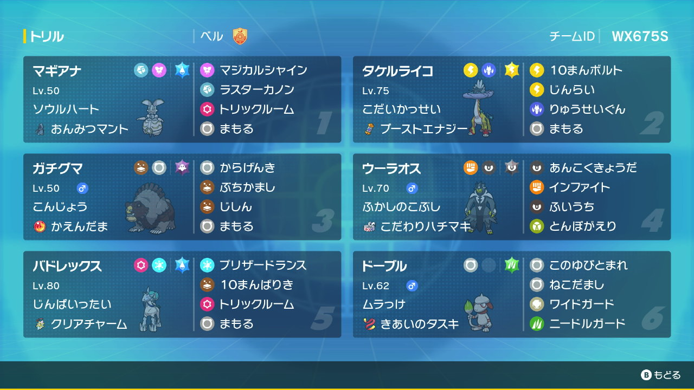

## 読みの基礎、盤面の把握

大事なことなので、最初に書くことにする。  
全局面は読みきれないので、現在局面だけを見てある程度はどちらが有利なのかを把握できる必要がある。  
ある選択をした結果がどの程度有利不利が傾いているのかが判断できないと勝つか負けるかまで読みからない限りはどの選択を選ぶかを決定できないからである。

一番難しいのがこの盤面の評価である。  
初期のチェスAIも評価関数という「駒が取られたらマイナス6点」などをいっぱい人間が考えて作ったルールをコンピュータに教えていたが、あまりにも大変な上にそんなに強くないので今や使われなくなった。

しかしながら、われわれ人間はこれをやるしかない。

### 公開情報を把握する

まずは公開情報を把握する（これは初手で最も重要なことで、ゲームを通じて非常に重要となる）。これを怠ると、最悪の場合はそのターンの選択を間違えたせいで取り返しがつかなくなり負ける。

1. 特性の発動順番
2. こだいかっせい/クォークチャージのステータス
3. おいかぜ/トリックルーム/あまごい等の残りターン数
4. 判明した持ち物
5. 判明した技構成
6. テラスタルがのこっているか

### 盤面を把握するには

基本的な盤面の把握は以下のようなものだろう:

1. 素早さ順を把握する
    
2. 素早さ順を考慮して縛り関係を判断する
    
3. どういう選択をすれば勝ち筋があるかを考える

### 勝ち筋を理解する

「この試合にどうやって勝つのか？」という大局的なプランを考える。  
例えば以下のようなものだ:

- 相手のエースポケモンを早期に処理する
- 「おいかぜ」を展開し、上から制圧する
- 相手のトリックルーム等を耐え凌ぎ、終盤の詰め合いに持ち込む

これらは一例だが、こういったことを考えておくことが重要だ。  
本当に最適な選択をするのならば、理想はその局面を点で見て最善手を考えるべきなのだが、45秒でそんなことはできない。  
勝ち筋をあらかじめ考えておくことで、勝ち筋が失われるような可能性を避けて勝ち筋を通すことに集中できる。

### 盤面の把握の練習

- 

- 

